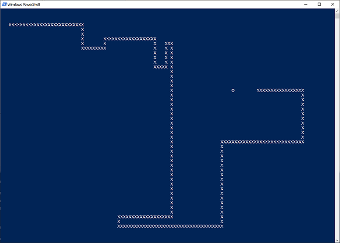
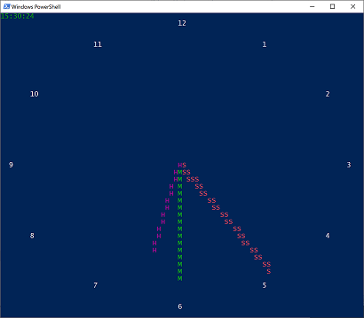

# PowerShell Misc

## Half Kilo PowerShell Snake

[Half Kilo PowerShell Snake](HalfKiloPowerShellSnake.ps1) *A PowerShell version of the classic snake game that's only 512 bytes big

*Also see explained version:* [HalfKiloPowerShellSnakeExplained](HalfKiloPowerShellSnakeExplained.ps1)

## Analog Console Clock

[Analog Console Clock](AnalogConsoleClock.ps1) *An "analog" clock for the console*

## Oneliners

See [PowerShellOneLiners.ps1](PowerShellOneLiners.ps1) for some PowerShell one-liners.

* [Some examples on multiple ways to achieve the same](PowerShellOneLiners.ps1#L9) *There's more than one way to do it*

* [Wait for a file to be be created and tail the content after it is created](PowerShellOneLiners.ps1#L52) *Good for log files*

* [Don't escape single quotes in JSON](PowerShellOneLiners.ps1#L75) *Easier readable ARM templates when updating them with PowerShell*

* [Escape non-ASCII](PowerShellOneLiners.ps1#L93) *Sometimes it's hard to get data out with non ASCII charsets - JSON support escaping*

* [Split array into chunks](PowerShellOneLiners.ps1#L124) *N objects in each array*

* [Split array into chunks](PowerShellOneLiners.ps1#L149) *Max N bytes in each file (plus a little overhead)*

## Useless PowerShell stuff

* [ColorRoll](useless/ColorRoll.ps1) *Show a text, letters are coloured, the colours are "rolling"*

* [RandomTextTransformer](useless/RandomTextTransformer.ps1) *Generate code like* `('hells power'.ToCharArray()|random -C 99 -S 100085736)-join''` *that will output the text* `powershell`

* [RollText](useless/RollText.ps1) *Fill the screen with "rolling" text*

* [Snow](useless/Snow.ps1) *Show some snow in the console*

* [SwitchPlace](useless/SwitchPlace.ps1) *Self generating code - strings switch place*
